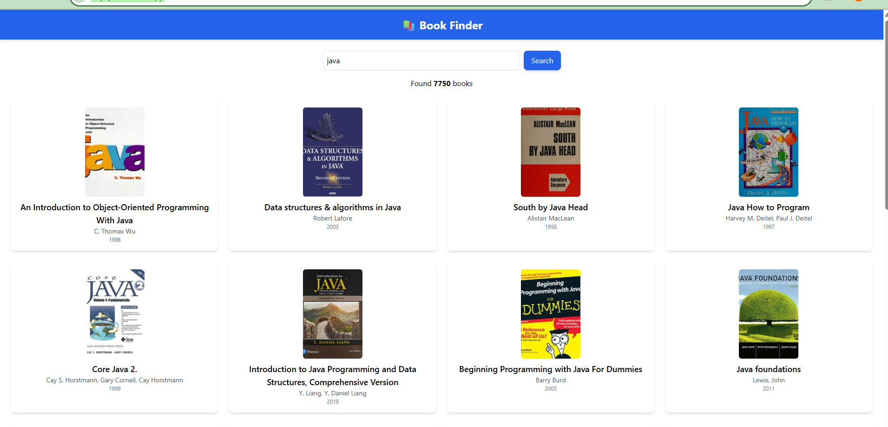

# 📚 Book Finder App  

  
🔍 A modern **Book Finder** app built with **React + OpenLibrary API**, featuring **search, pagination, and smooth UX**.  

🌐 **Live Demo** → [Book Finder Website](https://cftpq4-5173.csb.app/)  
📂 **Source Code** → [GitHub Repository](https://github.com/Nihal-3005/Book-Finder)  

---

## ✨ Features
✅ Search books by **title**  
✅ Displays **total results count**  
✅ **Pagination** (20 results per page)  
✅ **Prev / Next navigation** with smooth scroll to top  
✅ Built with **React, HTML, CSS, JavaScript only** (no extra tools)  

---

## 🖼️ Preview  

### 🔍 Search & Pagination  
.

---

## 🛠️ Tech Stack
- ⚛️ **React + ReactDOM** (plain setup, no CRA)  
- 🎨 **HTML + CSS** (Tailwind / custom styles)  
- 🌍 **OpenLibrary API** for book data  

---

## 📂 Project Structure
book-finder/
│
├── public/
│ └── index.html # Main HTML file
│
├── src/
│ ├── components/
│ │ ├── SearchBar.js # Search input field
│ │ └── BookCard.js # Book display card
│ │
│ ├── pages/
│ │ └── Home.js # Main page (fetch + pagination)
│ │
│ ├── App.js # Root component
│ └── index.js # Entry point (ReactDOM.render)
│
└── README.md
